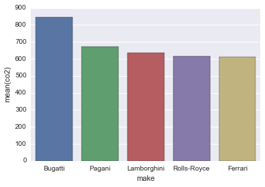

#IMPORTS FOR SPARK AND OTHER PYTHON PACKAGES 

    #Get spark/spark home from enviroment and execute spark
    import os
    import sys
    

    #change path here
    MY_PY4j_PATH = 'C:\\spark-2.0.1-bin-hadoop2.7\\python\\lib\\py4j-0.10.3-src.zip'
    spark_home = os.environ.get('SPARK_HOME', None)
    print(spark_home)
    if not spark_home:
        raise ValueError('SPARK_HOME environment variable is not set')
    
    sys.path.insert(0, os.path.join(spark_home,
                                    
                                    'python'))
    
    ## may need to adjust on your system depending on which Spark version you're using and where you installed it.
    sys.path.insert(0, os.path.join(spark_home, MY_PY4j_PATH)) 
    
    execfile(os.path.join(spark_home, 'python/pyspark/shell.py'))

    C:\spark-2.0.1-bin-hadoop2.7
    Welcome to
          ____              __
         / __/__  ___ _____/ /__
        _\ \/ _ \/ _ `/ __/  '_/
       /__ / .__/\_,_/_/ /_/\_\   version 2.0.1
          /_/
    
    Using Python version 2.7.12 (default, Jun 29 2016 11:07:13)
    SparkSession available as 'spark'.
    

    #change path here
    #Directories
    MY_VEHICLES_CSV_DATA_DIR = 'C:\\Users\\Aditya\\Desktop\\Big_Data_Analytics\\final_project\\Data\\'
    vehicles_path = os.path.join(MY_VEHICLES_CSV_DATA_DIR, 'vehicles.csv')
    emissions_path = os.path.join(MY_VEHICLES_CSV_DATA_DIR, 'emissions.csv')

    #import necessary 
    import numpy as np
    import pandas as pd
    import matplotlib as plt
    %matplotlib inline
    import seaborn as sns
    import matplotlib.pyplot as plt
    from matplotlib.pyplot import pie, axis, show
    from sklearn import preprocessing
    from sklearn.cross_validation import train_test_split
    from sklearn.neighbors import KNeighborsClassifier
    from sklearn.naive_bayes import MultinomialNB
    from sklearn.ensemble import RandomForestClassifier
    from sklearn.linear_model import LogisticRegression
    from sklearn.svm import SVC
    from sklearn.tree import DecisionTreeClassifier, export_graphviz
    from sklearn.metrics import accuracy_score
    from sklearn.metrics import precision_recall_fscore_support
    from sklearn.metrics import classification_report
    from collections import defaultdict

    import sys, getopt, pprint
    from pyspark.sql import SQLContext
    from pyspark.sql.types import *
    from pyspark import SparkConf
    from pyspark import SparkContext
    conf=(SparkConf().setMaster("local").setAppName("Cars").set("spark.executor.memory","1g"))
    sqlContext = SQLContext(sc)

# DATA EXTRACTION AND MANIPULATION

    vehicles = sc.textFile(vehicles_path)
    print vehicles.count()

    38033
    

    header = vehicles.first()
    fields = [StructField(field_name, StringType(), True) for field_name in header.split(',')]
    print len(fields)

    83
    

    #create schema
    schema = StructType(fields)
    #vehicles file without header
    vehicleHeader = vehicles.filter(lambda l: 'barrels08' in l)
    vehcilesNoHeader = vehicles.subtract(vehicleHeader)
    print vehcilesNoHeader.take(1)

    [u'11.771785714285713,0.0,0.0,0.0,29,29.2472,0,0.0,0.0,0.0,0.0,312,-1,0.0,312.0,28,28.3029,0,0.0,0.0,0.0,0.0,6,3.5,All-Wheel Drive,51,,7,1400,0,Premium,Premium Gasoline,7,-1,27,27.2284,0,0.0,0.0,0.0,0.0,0,0,34387,0,0,Lexus,RX 450h AWD,Y,false,0,0,0,0.0,0.0,0.0,0.0,Auto(AV-S6),38.5412,0.0,38.601,0.0,Small Sport Utility Vehicle 4WD,2014,-750,,,,,Hybrid,,,288V Ni-MH,TYX,,0.0,,Tue Jan 01 00:00:00 EST 2013,Mon Sep 26 00:00:00 EDT 2016,Y,0,0,0']
    

    vehicles_df = pd.read_csv(vehicles_path)
    emission_df = pd.read_csv(emissions_path)

    #prints information about dataframe along with percentage of null values
    def getDfInfo(df):
        nrow = df.shape[0]
        print "\n*****SHAPE********"
        print df.shape
        print "*****NULL PERCENTAGE*********"
        print df.isnull().sum() / nrow

    print getDfInfo(vehicles_df)

    
    *****SHAPE********
    (38032, 83)
    *****NULL PERCENTAGE*********
    barrels08          0.000000
    barrelsA08         0.000000
    charge120          0.000000
    charge240          0.000000
    city08             0.000000
    city08U            0.000000
    cityA08            0.000000
    cityA08U           0.000000
    cityCD             0.000000
    cityE              0.000000
    cityUF             0.000000
    co2                0.000000
    co2A               0.000000
    co2TailpipeAGpm    0.000000
    co2TailpipeGpm     0.000000
    comb08             0.000000
    comb08U            0.000000
    combA08            0.000000
    combA08U           0.000000
    combE              0.000000
    combinedCD         0.000000
    combinedUF         0.000000
    cylinders          0.003287
    displ              0.003234
    drive              0.031263
    engId              0.000000
    eng_dscr           0.404791
    feScore            0.000000
    fuelCost08         0.000000
    fuelCostA08        0.000000
                         ...   
    rangeCity          0.000000
    rangeCityA         0.000000
    rangeHwy           0.000000
    rangeHwyA          0.000000
    trany              0.000289
    UCity              0.000000
    UCityA             0.000000
    UHighway           0.000000
    UHighwayA          0.000000
    VClass             0.000000
    year               0.000000
    youSaveSpend       0.000000
    guzzler            0.939709
    trans_dscr         0.604412
    tCharger           0.863010
    sCharger           0.981857
    atvType            0.920751
    fuelType2          0.962479
    rangeA             0.962610
    evMotor            0.984750
    mfrCode            0.809687
    c240Dscr           0.999001
    charge240b         0.000000
    c240bDscr          0.999053
    createdOn          0.000000
    modifiedOn         0.000000
    startStop          0.832720
    phevCity           0.000000
    phevHwy            0.000000
    phevComb           0.000000
    dtype: float64
    None
    

# EXPLORATORY DATA ANALYSIS

    #deleteing columns with more than 1 NA
    vehicles_df= vehicles_df.dropna(thresh=len(vehicles_df) - 1, axis=1)

    getDfInfo(vehicles_df)

    
    *****SHAPE********
    (38032, 66)
    *****NULL PERCENTAGE*********
    barrels08          0
    barrelsA08         0
    charge120          0
    charge240          0
    city08             0
    city08U            0
    cityA08            0
    cityA08U           0
    cityCD             0
    cityE              0
    cityUF             0
    co2                0
    co2A               0
    co2TailpipeAGpm    0
    co2TailpipeGpm     0
    comb08             0
    comb08U            0
    combA08            0
    combA08U           0
    combE              0
    combinedCD         0
    combinedUF         0
    engId              0
    feScore            0
    fuelCost08         0
    fuelCostA08        0
    fuelType           0
    fuelType1          0
    ghgScore           0
    ghgScoreA          0
                      ..
    highwayUF          0
    hlv                0
    hpv                0
    id                 0
    lv2                0
    lv4                0
    make               0
    model              0
    mpgData            0
    phevBlended        0
    pv2                0
    pv4                0
    range              0
    rangeCity          0
    rangeCityA         0
    rangeHwy           0
    rangeHwyA          0
    UCity              0
    UCityA             0
    UHighway           0
    UHighwayA          0
    VClass             0
    year               0
    youSaveSpend       0
    charge240b         0
    createdOn          0
    modifiedOn         0
    phevCity           0
    phevHwy            0
    phevComb           0
    dtype: float64
    

    vehicle_emission_df = pd.merge(vehicles_df, emission_df[['score','scoreAlt','id']], how ='left', 
                                                          on=['id'])

    vehicle_emission_df.head()

<table border="1" class="dataframe">
  <thead>
    <tr style="text-align: right;">
      <th></th>
      <th>barrels08</th>
      <th>barrelsA08</th>
      <th>charge120</th>
      <th>charge240</th>
      <th>city08</th>
      <th>city08U</th>
      <th>cityA08</th>
      <th>cityA08U</th>
      <th>cityCD</th>
      <th>cityE</th>
      <th>...</th>
      <th>year</th>
      <th>youSaveSpend</th>
      <th>charge240b</th>
      <th>createdOn</th>
      <th>modifiedOn</th>
      <th>phevCity</th>
      <th>phevHwy</th>
      <th>phevComb</th>
      <th>score</th>
      <th>scoreAlt</th>
    </tr>
  </thead>
  <tbody>
    <tr>
      <th>0</th>
      <td>15.695714</td>
      <td>0</td>
      <td>0</td>
      <td>0</td>
      <td>19</td>
      <td>0</td>
      <td>0</td>
      <td>0</td>
      <td>0</td>
      <td>0</td>
      <td>...</td>
      <td>1985</td>
      <td>-1500</td>
      <td>0</td>
      <td>Tue Jan 01 00:00:00 EST 2013</td>
      <td>Tue Jan 01 00:00:00 EST 2013</td>
      <td>0</td>
      <td>0</td>
      <td>0</td>
      <td>NaN</td>
      <td>NaN</td>
    </tr>
    <tr>
      <th>1</th>
      <td>29.964545</td>
      <td>0</td>
      <td>0</td>
      <td>0</td>
      <td>9</td>
      <td>0</td>
      <td>0</td>
      <td>0</td>
      <td>0</td>
      <td>0</td>
      <td>...</td>
      <td>1985</td>
      <td>-8500</td>
      <td>0</td>
      <td>Tue Jan 01 00:00:00 EST 2013</td>
      <td>Tue Jan 01 00:00:00 EST 2013</td>
      <td>0</td>
      <td>0</td>
      <td>0</td>
      <td>NaN</td>
      <td>NaN</td>
    </tr>
    <tr>
      <th>2</th>
      <td>12.207778</td>
      <td>0</td>
      <td>0</td>
      <td>0</td>
      <td>23</td>
      <td>0</td>
      <td>0</td>
      <td>0</td>
      <td>0</td>
      <td>0</td>
      <td>...</td>
      <td>1985</td>
      <td>250</td>
      <td>0</td>
      <td>Tue Jan 01 00:00:00 EST 2013</td>
      <td>Tue Jan 01 00:00:00 EST 2013</td>
      <td>0</td>
      <td>0</td>
      <td>0</td>
      <td>NaN</td>
      <td>NaN</td>
    </tr>
    <tr>
      <th>3</th>
      <td>29.964545</td>
      <td>0</td>
      <td>0</td>
      <td>0</td>
      <td>10</td>
      <td>0</td>
      <td>0</td>
      <td>0</td>
      <td>0</td>
      <td>0</td>
      <td>...</td>
      <td>1985</td>
      <td>-8500</td>
      <td>0</td>
      <td>Tue Jan 01 00:00:00 EST 2013</td>
      <td>Tue Jan 01 00:00:00 EST 2013</td>
      <td>0</td>
      <td>0</td>
      <td>0</td>
      <td>NaN</td>
      <td>NaN</td>
    </tr>
    <tr>
      <th>4</th>
      <td>17.347895</td>
      <td>0</td>
      <td>0</td>
      <td>0</td>
      <td>17</td>
      <td>0</td>
      <td>0</td>
      <td>0</td>
      <td>0</td>
      <td>0</td>
      <td>...</td>
      <td>1993</td>
      <td>-4250</td>
      <td>0</td>
      <td>Tue Jan 01 00:00:00 EST 2013</td>
      <td>Tue Jan 01 00:00:00 EST 2013</td>
      <td>0</td>
      <td>0</td>
      <td>0</td>
      <td>NaN</td>
      <td>NaN</td>
    </tr>
  </tbody>
</table>

5 rows × 68 columns

    makecount = pd.value_counts(vehicle_emission_df['make'].values, sort=False)
    makecount = makecount.to_frame().reset_index()
    makecount.columns = ('make','count')
    makecount = makecount[makecount['count']>500]

    plt.figure(figsize=(8, 8))
    pie(makecount['count'], labels=makecount['make']);
    show()

    vclass_co2_df = vehicle_emission_df[vehicle_emission_df['co2'] >= 0]
    vclass_co2_df=pd.DataFrame(vclass_co2_df.groupby(vclass_co2_df['VClass'])['co2'].mean().reset_index())
    

    group_data1 = vclass_co2_df.sort('co2',ascending=False)[0:5]

    group_data2 = vclass_co2_df.sort('co2',ascending=True)[0:5]

    #5 Car vehicle class with highest CO2 emission
    sns.barplot(x='VClass', y='co2', data=group_data1 , label='make')
    plt.figure(figsize=(8, 8))
    plt.savefig("Car_vehicle_class_highest_CO2_emission.png")

    <matplotlib.figure.Figure at 0x3a342d68>

    #5 Car vehicle class with lowest CO2 emission
    sns.barplot(x='VClass', y='co2', data=group_data2)
    plt.figure(figsize=(8, 8))
    plt.savefig("Car_vehicle_class_with_lowest_CO2_emission.png")

    <matplotlib.figure.Figure at 0x37c4ae80>

    make_co2_df = vehicle_emission_df[vehicle_emission_df['co2'] >= 0]
    make_co2_df=pd.DataFrame(make_co2_df.groupby(make_co2_df['make'])['co2'].mean().reset_index())
    

    group_data1 = make_co2_df.sort('co2',ascending=False)[0:5]

    group_data2 = make_co2_df.sort('co2',ascending=True)[0:5]

    #5 Car vehicle class with highest CO2 emission
    sns.barplot(x='make', y='co2', data=group_data1 , label='make')
    plt.figure(figsize=(8, 8))
    plt.savefig("Car_vehicle_make_highest_CO2_emission.png")

    <matplotlib.figure.Figure at 0x3a0b8a20>

    #5 Car vehicle class with lowest CO2 emission
    sns.barplot(x='make', y='co2', data=group_data2)
    plt.figure(figsize=(8, 8))
    plt.savefig("Car_vehicle_make_with_lowest_CO2_emission.png")

    <matplotlib.figure.Figure at 0x3c446b38>

    fuel_type_co2_df = vehicle_emission_df[vehicle_emission_df['co2'] >= 0]
    fuel_type_co2_df=pd.DataFrame(fuel_type_co2_df.groupby(fuel_type_co2_df['fuelType'])['co2'].mean().reset_index())
    
    

    group_data1 = fuel_type_co2_df.sort('co2',ascending=False)[0:5]
    group_data2 = fuel_type_co2_df.sort('co2',ascending=True)[0:5]

    #5 Car vehicle fuel type with highest CO2 emission
    sns.barplot(x='fuelType', y='co2', data=group_data1 , label='Fuel Type')
    plt.savefig("Car_vehicle_fuel_type_highest_CO2_emission.png")

    #5 Car vehicle fuel type with lowest CO2 emission
    sns.barplot(x='fuelType', y='co2', data=group_data2)
    plt.savefig("Car_vehicle_fuel_type_with_lowest_CO2_emission.png")

    
    #How You save spend has varied over years
    
    sns.factorplot(data=vehicle_emission_df, x="year", y="fuelCost08",size=4, aspect=2,label = 'FuelCost vs Year')  
    plt.savefig("fuelCostOvertheYears.png")
    

    sns.factorplot(data=vehicle_emission_df, x="year", y="co2TailpipeGpm",size=4, aspect=2,label = 'co2TailPipe vs Year')  
    plt.savefig("co2OvertheYears.png")

    #As score ranges from 1 to 10 remove rows having -2 and -12
    vehicle_emission_df_save_spend  = vehicle_emission_df[vehicle_emission_df.score>0]
    sns.factorplot(data=vehicle_emission_df_save_spend, x="year", y="youSaveSpend",size=4, aspect=2,label = 'SaveSpend vs Year')
    plt.savefig("youSaveSpendOverYears.png")

# FEATURE EXTRACTION FOR MODELLING

    #Modelling Data to predict 
    
    #Feature Selection 
    #removing columns with NA and replacing -1 with 0 i.e. missing data
    vehicle_emission_df= vehicle_emission_df.dropna(axis=0)
    vehicle_emission_df = vehicle_emission_df.replace(-1,0)

    #prints information about dataframe along with percentage of null values
    def getDfZeroInfo(df):
        nrow = df.shape[0]
        print "\n*****SHAPE********"
        print df.shape
        print "*****Zero PERCENTAGE*********"
        print (df.shape[0] - df.astype(bool).sum(axis=0))/nrow
    getDfZeroInfo(vehicle_emission_df)

    
    *****SHAPE********
    (31397, 68)
    *****Zero PERCENTAGE*********
    barrels08          0.000000
    barrelsA08         0.933401
    charge120          1.000000
    charge240          0.990795
    city08             0.000000
    city08U            0.455075
    cityA08            0.933401
    cityA08U           0.948148
    cityCD             0.999236
    cityE              0.990795
    cityUF             0.996051
    co2                0.606491
    co2A               0.968819
    co2TailpipeAGpm    0.937351
    co2TailpipeGpm     0.005255
    comb08             0.000000
    comb08U            0.455075
    combA08            0.933401
    combA08U           0.948148
    combE              0.990795
    combinedCD         0.998981
    combinedUF         0.996051
    engId              0.394974
    feScore            0.602032
    fuelCost08         0.000000
    fuelCostA08        0.935726
    fuelType           0.000000
    fuelType1          0.000000
    ghgScore           0.602032
    ghgScoreA          0.967067
                         ...   
    hpv                0.920056
    id                 0.000000
    lv2                0.852151
    lv4                0.612670
    make               0.000000
    model              0.000000
    mpgData            0.000000
    phevBlended        0.997675
    pv2                0.852151
    pv4                0.612670
    range              0.994745
    rangeCity          0.994936
    rangeCityA         0.996051
    rangeHwy           0.994936
    rangeHwyA          0.996051
    UCity              0.000000
    UCityA             0.933401
    UHighway           0.000000
    UHighwayA          0.933401
    VClass             0.000000
    year               0.000000
    youSaveSpend       0.029238
    charge240b         0.998185
    createdOn          0.000000
    modifiedOn         0.000000
    phevCity           0.996051
    phevHwy            0.996051
    phevComb           0.996051
    score              0.000000
    scoreAlt           0.986241
    dtype: float64
    

    #Selecting columns with less than 30% of zeroes in their data 
    columns_to_select = (vehicle_emission_df.shape[0] - vehicle_emission_df.astype(bool).sum(axis=0))/vehicle_emission_df.shape[0]
    columns_to_select = np.where(columns_to_select.values<0.30,columns_to_select.index,None)
    columns_to_select = columns_to_select[columns_to_select != np.array(None)]
    print columns_to_select

    ['barrels08' 'city08' 'co2TailpipeGpm' 'comb08' 'fuelCost08' 'fuelType'
     'fuelType1' 'highway08' 'id' 'make' 'model' 'mpgData' 'UCity' 'UHighway'
     'VClass' 'year' 'youSaveSpend' 'createdOn' 'modifiedOn' 'score']
    

    #Removing ids and dates as they do not contribute to our prediction
    vehicle_emission_df = vehicle_emission_df[['barrels08', 'city08', 'co2TailpipeGpm' ,'comb08'
    , 'fuelCost08' ,'fuelType' ,'fuelType1' ,'highway08','make',
     'model' ,'UCity' ,'UHighway' ,'VClass' ,'year', 'youSaveSpend', 'score']]

    getDfInfo(vehicle_emission_df)

    
    *****SHAPE********
    (31397, 16)
    *****NULL PERCENTAGE*********
    barrels08         0
    city08            0
    co2TailpipeGpm    0
    comb08            0
    fuelCost08        0
    fuelType          0
    fuelType1         0
    highway08         0
    make              0
    model             0
    UCity             0
    UHighway          0
    VClass            0
    year              0
    youSaveSpend      0
    score             0
    dtype: float64
    

    #5 Distribution of Class variable
    count_of_class_df=pd.DataFrame(vehicle_emission_df.groupby(vehicle_emission_df['score']).count().reset_index())
    sns.barplot(x='score', y='make', data=count_of_class_df , label='Count of Scores')
    plt.savefig("Distribution_of_Scores.png")

    #preprocessing data
    #converting all categorical to discrete
    vehicle_emission_df = vehicle_emission_df[vehicle_emission_df['score']>0]
    d = defaultdict(preprocessing.LabelEncoder)
    vehicle_emission_encoded_df = vehicle_emission_df[['fuelType' ,'fuelType1','make',
     'model' ,'VClass' ,'year']].apply(lambda x: d[x.name].fit_transform(x))
    
    vehicle_emission_encoded_df_full = vehicle_emission_encoded_df.join(vehicle_emission_df[['barrels08', 'city08', 'co2TailpipeGpm' ,'comb08'
    , 'fuelCost08' , 'highway08', 'UCity' ,'UHighway' , 'youSaveSpend','score']])
    
    vehicle_emission_encoded_df_full.head()
    # Inverse the encoded
    #fit.apply(lambda x: d[x.name].inverse_transform(x))
    
    # Using the dictionary to label future data
    #df.apply(lambda x: d[x.name].transform(x))
    
    

<table border="1" class="dataframe">
  <thead>
    <tr style="text-align: right;">
      <th></th>
      <th>fuelType</th>
      <th>fuelType1</th>
      <th>make</th>
      <th>model</th>
      <th>VClass</th>
      <th>year</th>
      <th>barrels08</th>
      <th>city08</th>
      <th>co2TailpipeGpm</th>
      <th>comb08</th>
      <th>fuelCost08</th>
      <th>highway08</th>
      <th>UCity</th>
      <th>UHighway</th>
      <th>youSaveSpend</th>
      <th>score</th>
    </tr>
  </thead>
  <tbody>
    <tr>
      <th>10370</th>
      <td>6</td>
      <td>4</td>
      <td>0</td>
      <td>1436</td>
      <td>21</td>
      <td>0</td>
      <td>18.311667</td>
      <td>16</td>
      <td>493.722222</td>
      <td>18</td>
      <td>2200</td>
      <td>22</td>
      <td>19.4</td>
      <td>31.0</td>
      <td>-4750</td>
      <td>1</td>
    </tr>
    <tr>
      <th>10371</th>
      <td>6</td>
      <td>4</td>
      <td>0</td>
      <td>1436</td>
      <td>21</td>
      <td>0</td>
      <td>18.311667</td>
      <td>16</td>
      <td>493.722222</td>
      <td>18</td>
      <td>2200</td>
      <td>22</td>
      <td>19.4</td>
      <td>31.0</td>
      <td>-4750</td>
      <td>1</td>
    </tr>
    <tr>
      <th>10372</th>
      <td>6</td>
      <td>4</td>
      <td>0</td>
      <td>1436</td>
      <td>21</td>
      <td>0</td>
      <td>18.311667</td>
      <td>16</td>
      <td>493.722222</td>
      <td>18</td>
      <td>2200</td>
      <td>22</td>
      <td>19.3</td>
      <td>31.1</td>
      <td>-4750</td>
      <td>1</td>
    </tr>
    <tr>
      <th>10373</th>
      <td>6</td>
      <td>4</td>
      <td>0</td>
      <td>1436</td>
      <td>21</td>
      <td>0</td>
      <td>18.311667</td>
      <td>16</td>
      <td>493.722222</td>
      <td>18</td>
      <td>2200</td>
      <td>22</td>
      <td>19.3</td>
      <td>31.1</td>
      <td>-4750</td>
      <td>1</td>
    </tr>
    <tr>
      <th>10374</th>
      <td>6</td>
      <td>4</td>
      <td>3</td>
      <td>1955</td>
      <td>21</td>
      <td>0</td>
      <td>15.695714</td>
      <td>18</td>
      <td>423.190476</td>
      <td>21</td>
      <td>1900</td>
      <td>26</td>
      <td>22.0</td>
      <td>36.2</td>
      <td>-3250</td>
      <td>1</td>
    </tr>
  </tbody>
</table>

# DATA MODELING

    #train test split
    vehicle_emission = vehicle_emission_encoded_df_full.ix[:,0:15]
    vehicle_emission_score = vehicle_emission_encoded_df_full.ix[:,15:16]
    X_train, X_test, y_train, y_test = train_test_split(vehicle_emission, vehicle_emission_score, test_size=0.2, random_state=0)
    X_train.shape

    (25101, 15)

    #normalizing the data on X_train and X_test
    min_max=preprocessing.MinMaxScaler()
    X_train_minmax=min_max.fit_transform(X_train[['barrels08', 'city08', 'co2TailpipeGpm' ,'comb08'
    , 'fuelCost08' , 'highway08', 'UCity' ,'UHighway' , 'youSaveSpend']])
    X_test_minmax=min_max.fit_transform(X_test[['barrels08', 'city08', 'co2TailpipeGpm' ,'comb08'
    , 'fuelCost08' , 'highway08', 'UCity' ,'UHighway' , 'youSaveSpend']])
    X_train_minmax

    array([[ 0.42763372,  0.07692308,  0.42027681, ...,  0.07227234,
             0.15972222,  0.74358974],
           [ 0.49917951,  0.05384615,  0.5       , ...,  0.04942153,
             0.11527778,  0.57692308],
           [ 0.44909746,  0.07692308,  0.44964555, ...,  0.07010045,
             0.12037431,  0.62820513],
           ..., 
           [ 0.44909746,  0.06923077,  0.45      , ...,  0.05987392,
             0.13750278,  0.62820513],
           [ 0.44909746,  0.06923077,  0.45      , ...,  0.06496487,
             0.12826667,  0.62820513],
           [ 0.44909746,  0.06923077,  0.45      , ...,  0.06430113,
             0.1375    ,  0.62820513]])

    #let's consider the base class
    y_train.score.value_counts()/y_train.score.count() 
    

    5     0.452094
    6     0.322338
    1     0.085017
    2     0.045656
    9     0.040835
    7     0.028206
    8     0.017967
    10    0.005617
    3     0.002191
    4     0.000080
    dtype: float64

    #KNN on MultiClass
    knn=KNeighborsClassifier(n_neighbors=10)
    y_pred = knn.fit(X_train_minmax,y_train.values.ravel()).predict(X_test_minmax)
    print accuracy_score(y_test,y_pred)
    print classification_report(y_test, y_pred) 

    0.416985340982
                 precision    recall  f1-score   support
    
            1.0       0.13      0.11      0.12       520
            2.0       0.24      0.36      0.29       264
            3.0       0.00      0.00      0.00        12
            5.0       0.50      0.60      0.55      2859
            6.0       0.38      0.34      0.36      2017
            7.0       0.27      0.19      0.22       177
            8.0       0.27      0.02      0.04       129
            9.0       0.29      0.04      0.06       274
           10.0       1.00      1.00      1.00        24
    
    avg / total       0.40      0.42      0.40      6276
    
    

    #Multinomial NB
    mnb = MultinomialNB()
    y_pred = mnb.fit(X_train_minmax, y_train.values.ravel()).predict(X_test_minmax)
    print '********Multinomial Naive Bayes***********'
    print accuracy_score(y_test,y_pred)
    print classification_report(y_test, y_pred) 

    ********Multinomial Naive Bayes***********
    0.458094327597
                 precision    recall  f1-score   support
    
            1.0       0.00      0.00      0.00       520
            2.0       0.00      0.00      0.00       264
            3.0       0.00      0.00      0.00        12
            5.0       0.46      1.00      0.63      2859
            6.0       0.00      0.00      0.00      2017
            7.0       0.00      0.00      0.00       177
            8.0       0.00      0.00      0.00       129
            9.0       0.00      0.00      0.00       274
           10.0       1.00      0.67      0.80        24
    
    avg / total       0.21      0.46      0.29      6276
    
    

    #Random Forest Classifier
    clf = RandomForestClassifier(n_estimators=100)
    y_pred = clf.fit(X_train_minmax, y_train.values.ravel()).predict(X_test_minmax)
    print '********Random Forest Classifier***********'
    print accuracy_score(y_test,y_pred)
    print classification_report(y_test, y_pred)

    ********Random Forest Classifier***********
    0.41459528362
                 precision    recall  f1-score   support
    
            1.0       0.16      0.08      0.10       520
            2.0       0.23      0.27      0.25       264
            3.0       0.00      0.00      0.00        12
            5.0       0.52      0.44      0.48      2859
            6.0       0.37      0.57      0.45      2017
            7.0       0.29      0.14      0.18       177
            8.0       0.32      0.12      0.17       129
            9.0       0.35      0.03      0.06       274
           10.0       1.00      1.00      1.00        24
    
    avg / total       0.41      0.41      0.40      6276
    
    

    #Logistic Regression
    lg = LogisticRegression(multi_class = 'multinomial',solver='newton-cg')
    y_pred = lg.fit(X_train_minmax, y_train.values.ravel()).predict(X_test_minmax)
    print '********Logistic Regression Classifier***********'
    print accuracy_score(y_test,y_pred)
    print(classification_report(y_test, y_pred))

    ********Logistic Regression Classifier***********
    0.481835564054
                 precision    recall  f1-score   support
    
            1.0       0.00      0.00      0.00       520
            2.0       0.59      0.09      0.15       264
            3.0       0.00      0.00      0.00        12
            5.0       0.49      0.89      0.63      2859
            6.0       0.43      0.20      0.27      2017
            7.0       0.41      0.10      0.16       177
            8.0       0.00      0.00      0.00       129
            9.0       0.21      0.04      0.06       274
           10.0       1.00      0.96      0.98        24
    
    avg / total       0.41      0.48      0.39      6276
    
    

    #Support Vector Machines
    svc = SVC()
    y_pred = svc.fit(X_train_minmax, y_train.values.ravel()).predict(X_test_minmax)
    print '********Support Vector Machines Classifier***********'
    print accuracy_score(y_test,y_pred)
    print(classification_report(y_test, y_pred))

    ********Support Vector Machines Classifier***********
    0.459209687699
                 precision    recall  f1-score   support
    
            1.0       0.00      0.00      0.00       520
            2.0       0.00      0.00      0.00       264
            3.0       0.00      0.00      0.00        12
            5.0       0.46      1.00      0.63      2859
            6.0       0.00      0.00      0.00      2017
            7.0       0.00      0.00      0.00       177
            8.0       0.00      0.00      0.00       129
            9.0       0.00      0.00      0.00       274
           10.0       1.00      0.96      0.98        24
    
    avg / total       0.21      0.46      0.29      6276
    
    

    #Decision Tree Classifier
    dc = DecisionTreeClassifier()
    y_pred = dc.fit(X_train_minmax, y_train.values.ravel()).predict(X_test_minmax)
    print '********Decision Tree Classifier***********'
    print accuracy_score(y_test,y_pred)
    print(classification_report(y_test, y_pred))

    ********Decision Tree Classifier***********
    0.378266411727
                 precision    recall  f1-score   support
    
            1.0       0.14      0.16      0.15       520
            2.0       0.17      0.31      0.22       264
            3.0       0.00      0.00      0.00        12
            4.0       0.00      0.00      0.00         0
            5.0       0.48      0.50      0.49      2859
            6.0       0.37      0.34      0.36      2017
            7.0       0.25      0.25      0.25       177
            8.0       0.24      0.06      0.10       129
            9.0       0.13      0.02      0.04       274
           10.0       1.00      1.00      1.00        24
    
    avg / total       0.38      0.38      0.37      6276
    
    

# Exporting Data for Visualizations using D3.js  

    make_emission = pd.DataFrame(vehicle_emission_df.groupby(['make'])['co2TailpipeGpm'].sum())
    make_emission.to_csv('make_emission.csv')

    
